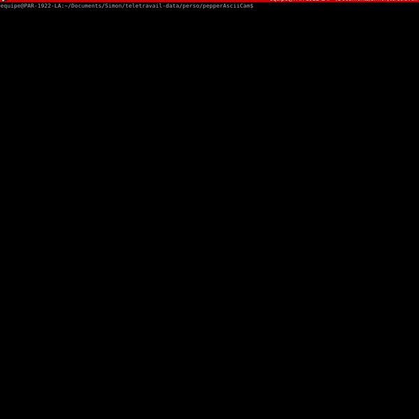

# pepperAsciiCamViewer

Display a video feed from the SoftBank Robotics famous robot Pepper top camera as ascii characters.

## Requirements
Python module `Pillow`: https://pillow.readthedocs.io/en/stable/index.html and python module `qi` developed by SoftBank Robotics Europe.

```
pip install -r requirements.txt 
```

Use:
```
python pepperAsciiCam.py 192.168.1.38  
```

## Example


